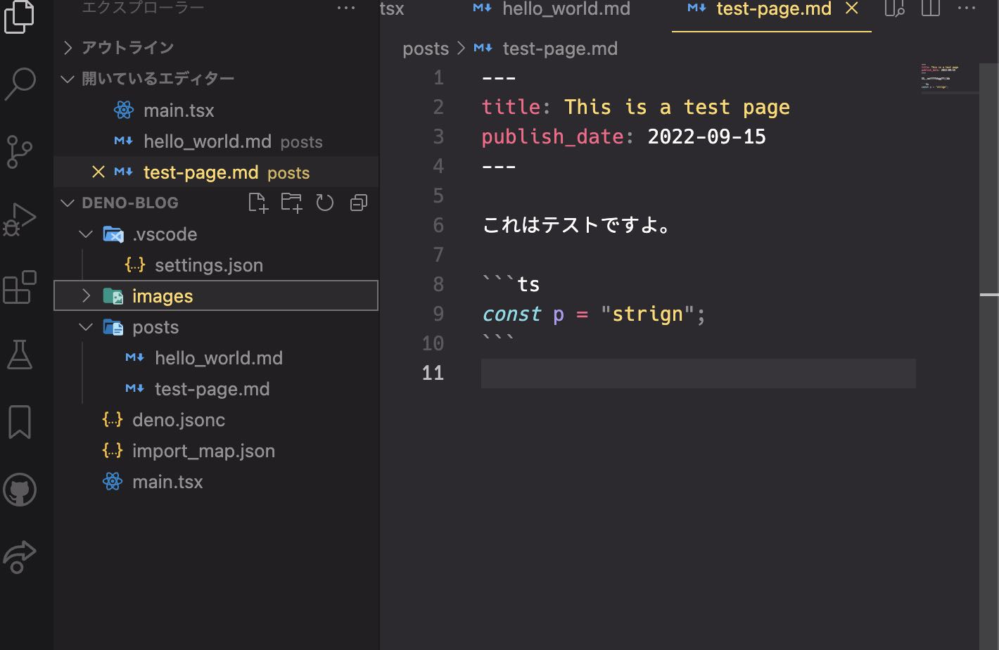

## コードブロック

JavaScript

```js
const p = "string";
```

TypeScript

```ts
const p = "string" as string;
```

TSX

```tsx
const p = "string";
const Page = (): NextPage => {
  return <div>test</div>;
};
```

ファイル名を付けると syntax-highlight されない。

```tsx:test.tsx
const p = "string";
const Page = (): NextPage => {
  return <div>test</div>;
};
```

## diff

```diff
const p = "string";
const Page = (): NextPage => {
- return <div>test</div>
+ return (
+   <div>
+     test
+   </div>
+ );
};
```

## 画像表示

`posts/images/` 配下にある画像を表示してみる。

マークダウン表示。

```md

```


## リンク

wiki link [[deno-blog-making|deno_blog の作り方]]

通常の markdown リンク [deno-blog-making](deno-blog-making)
